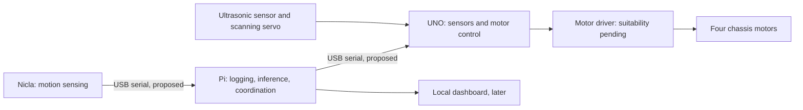

# CarEdgeAI

An experimental rover that combines an Arduino Nicla Sense ME, Raspberry Pi 3,
ELEGOO UNO R3 Most Complete Starter Kit, and DollaTek four-wheel chassis to
explore AI running locally on embedded devices.

**Status:** project initialized; hardware integration, firmware, data collection,
and model development have not started. This repository currently contains
planning documentation and a source-directory scaffold, not runnable software.

## Goal

Build a manually controlled rover, collect labeled motion data, and train a small
model to recognize driving surfaces or unusual vibration. Run inference on the
Pi first and use validated predictions to adjust speed or stop. Later, explore
running a compact classifier directly on the Nicla (TinyML).

Training can happen on a development computer; the deployed robot should make
its driving decisions locally without a cloud connection.

## Proposed architecture

The UNO should enforce command timeouts independently of the Pi. Obstacle
avoidance starts with distance rules; terrain recognition is the first learned
behavior. Wiring, pin assignments, power design, and message formats are still
undecided.

## Development milestones

1. Verify hardware, motor-driver capacity, and power arrangements.
2. Demonstrate manual driving and reliable stopping on communication loss.
3. Record labeled motion data across surfaces and separate driving sessions.
4. Compare a vibration-threshold baseline with a small learned classifier.
5. Run inference on the Pi and validate speed adaptation at low speed.
6. Explore Nicla inference, additional sensors, and a local dashboard.

## Repository guide

| Path | Purpose |
|---|---|
| [docs/HARDWARE.md](docs/HARDWARE.md) | Inventory, evidence, and unresolved checks |
| [docs/ARCHITECTURE.md](docs/ARCHITECTURE.md) | Proposed responsibilities and AI evaluation |
| [firmware/uno/](firmware/uno/README.md) | Future motor and peripheral firmware |
| [firmware/nicla/](firmware/nicla/README.md) | Future sensing and TinyML firmware |
| [pi/](pi/README.md) | Future robot coordination and logging |
| [ml/](ml/README.md) | Future training and evaluation |

## Related work

The local Embedded-vibration-monitor project provides relevant experience with
Nicla motion sensing and a Raspberry Pi gateway. Its application thresholds,
private deployment settings, and validation results do not transfer to this rover.

## License

A license has not yet been selected. No open-source license is granted by this
repository at this stage.
