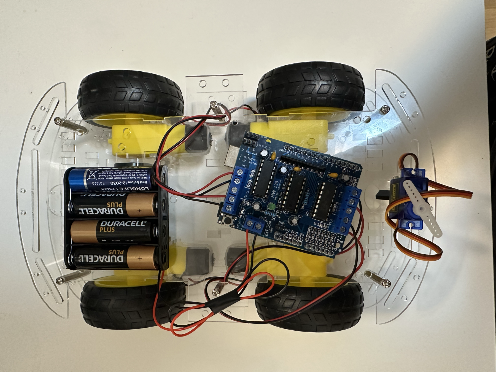
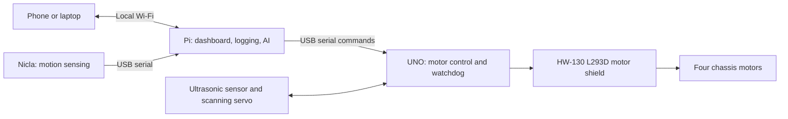

# CarEdgeAI

An experimental rover that combines an Arduino Nicla Sense ME, Raspberry Pi 3,
ELEGOO UNO R3 Most Complete Starter Kit, and DollaTek four-wheel chassis to
explore AI running locally on embedded devices.

**Status:** the UNO R3, HW-130 motor shield, and all four chassis motors have
passed raised-wheel bench tests using USB motor power through the fitted yellow
jumper. The separate four-AA motor path did not power the shield and remains to
be diagnosed with fresh matched batteries and a multimeter. The repository
includes
runnable Arduino sketches for individual motor pulses, a combined four-motor
pulse, and manual serial driving with an automatic stop timeout. Raspberry Pi,
Nicla sensing, data collection, and model development are the next stages. The
target Pi–UNO architecture and its separate power paths are now selected.

## Goal

Build a manually controlled rover, collect labeled motion data, and train a small
model to recognize driving surfaces or unusual vibration. Run inference on the
Pi first and use validated predictions to adjust speed or stop. Later, explore
running a compact classifier directly on the Nicla (TinyML).

Training can happen on a development computer; the deployed robot should make
its driving decisions locally without a cloud connection.

## Target architecture

The target architecture uses separate power paths: a USB power bank powers the
Pi, the Pi powers and communicates with the UNO over USB, and a verified motor
battery will power the shield's `EXT_PWR` input with the yellow `PWR` jumper
removed. The UNO
enforces the 300 ms command timeout independently of the Pi. See the
[complete architecture](docs/ARCHITECTURE.md) for interfaces, safety rules, and
the build sequence.

## Development milestones

1. Verify motor electrical limits and select the final power arrangement.
2. Move the tested Mac hold-to-drive web controller onto the Pi for untethered
   control.
3. Record labeled motion data across surfaces and separate driving sessions.
4. Compare a vibration-threshold baseline with a small learned classifier.
5. Run inference on the Pi and validate speed adaptation at low speed.
6. Explore Nicla inference, additional sensors, and a local dashboard.

## Repository guide

| Path | Purpose |
|---|---|
| [docs/HARDWARE.md](docs/HARDWARE.md) | Inventory, evidence, and unresolved checks |
| [docs/COMPONENTS.md](docs/COMPONENTS.md) | GitHub-ready component inventory and control options |
| [docs/ARCHITECTURE.md](docs/ARCHITECTURE.md) | Target system, power, interfaces, safety, and build sequence |
| [docs/PI_SETUP.md](docs/PI_SETUP.md) | Confirmed Pi hardware, safe inspection, and reusable deployment lessons |
| [firmware/uno/](firmware/uno/README.md) | Tested motor-control sketches and setup instructions |
| [firmware/nicla/](firmware/nicla/README.md) | Future sensing and TinyML firmware |
| [pi/](pi/README.md) | Future robot coordination and logging |
| [ml/](ml/README.md) | Future training and evaluation |
| [tools/](tools/README.md) | Tested Mac web controller and setup instructions |

## Related work

The local Embedded-vibration-monitor project provides relevant experience with
Nicla motion sensing and a Raspberry Pi gateway. Its application thresholds,
private deployment settings, and validation results do not transfer to this rover.

## License

A license has not yet been selected. No open-source license is granted by this
repository at this stage.
