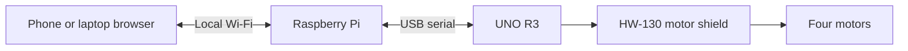

# RobotCar EdgeAI

Build a four-wheel rover controlled from a browser over local Wi-Fi. A Raspberry
Pi hosts the controls and sends USB commands to an Arduino UNO, which drives
four motors through an HW-130 L293D shield.

**Start here: [step-by-step setup guide](docs/GETTING_STARTED.md).** It covers
hardware connections, firmware upload, Pi setup, deployment, and first driving
tests. No previous project installation is required.

## What you can build today

- Forward, reverse, pivot, and curved movement using keyboard or on-screen controls.
- Hold-to-drive operation, adjustable PWM and curve strength, and explicit stop.
- One active browser controller at a time, with connection status and messages.
- A UNO watchdog that releases the motors after 300 ms without movement commands.
- Optional automatic startup on the Pi.

Pi/browser driving with the current controls has been reported working.
Automatic-startup installation and reboot verification remain unconfirmed on
hardware. Detailed disconnect tests, motor electrical limits, and sustained
power reliability remain open; follow the guide's checks on your own build.
This is an experimental, manually controlled rover. There is no obstacle
avoidance, battery telemetry, or autonomous driving.

## Required hardware

Raspberry Pi 3 Model B with microSD and a suitable power supply; UNO R3;
HW-130 L293D V1-style motor shield; four-motor chassis; separate motor battery;
USB data cable; and a computer for uploading firmware and deploying files.
See [hardware and wiring](docs/HARDWARE.md) for the complete list and motor map.
A Nicla board and the other starter-kit sensors are not needed for this stage.

## Repository guide

| Path | Purpose |
|---|---|
| [Setup guide](docs/GETTING_STARTED.md) | Complete path from hardware to browser control |
| [Hardware](docs/HARDWARE.md) | Required parts, wiring, and power checks |
| [Pi preparation](docs/PI_SETUP.md) | OS prerequisites, SSH, Wi-Fi, and serial access |
| [Pi operation](pi/README.md) | Startup service, updates, and troubleshooting |
| [UNO firmware](firmware/uno/README.md) | The one required sketch and serial protocol |
| [Controller](tools/README.md) | Shared web server and optional direct USB use |
| [Architecture](docs/ARCHITECTURE.md) | How the current implementation works |
| [Development checks](tests/README.md) | Software tests without physical hardware |

## Future work

Nicla motion sensing, labeled recordings, surface classification, and local
inference are planned. No rover dataset or trained model is included. Obstacle
sensing and battery monitoring are also future extensions.

## License

A license has not yet been selected. No open-source license is granted by this
repository at this stage.
