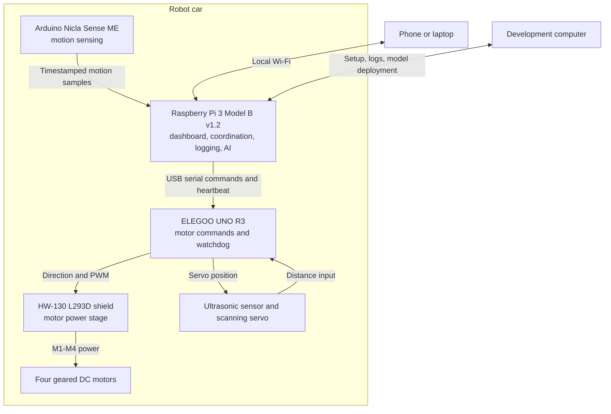
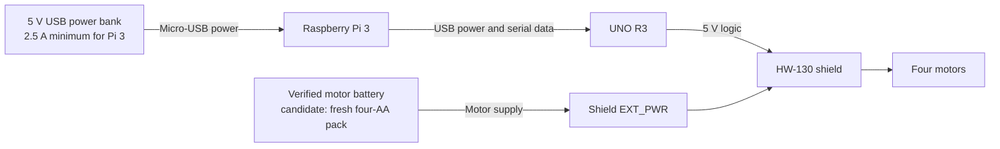
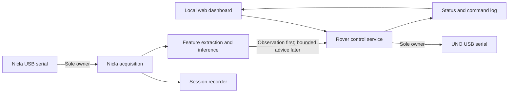

# Target Architecture

This is the agreed architecture for the first complete CarEdgeAI rover. The
Raspberry Pi provides the user interface and higher-level behavior. The UNO
owns motor control and the immediate stop behavior. The HW-130 shield supplies
motor current, while the Nicla supplies motion measurements for later AI work.

## System overview

The phone or laptop sends intentions such as forward, backward, turn, and stop.
It never drives motor pins directly. The Pi translates those intentions into a
small command stream for the UNO. The UNO validates the stream and generates
the motor signals. This keeps the fast stop mechanism independent of Linux,
Wi-Fi, the dashboard, and future AI code.

## Power architecture

Power rules:

- Keep the shield's yellow `PWR` jumper **removed**. This separates the noisy
  motor supply from the UNO and Pi supply path.
- Use a compact USB power bank rated for at least 5 V/2.5 A to power the Pi.
- Let the Pi power the UNO through their USB data cable.
- Test fresh matched cells in the switched four-AA holder at the shield's
  `EXT_PWR` input, with polarity checked against the `+` and `GND` markings.
  Keep this supply provisional until its open-circuit and loaded voltage are
  measured and it starts the motors without the jumper.
- Do not add the kit's 9 V battery to the installed system. It is only useful
  for independent UNO experiments when USB power is absent.
- Shut Linux down cleanly before turning off or disconnecting the power bank.
- The final power-bank model, physical mounting, and loaded runtime still need
  to be selected and tested on the chassis.

## Component responsibilities

| Component | Owns | Does not own |
|---|---|---|
| Phone or laptop | Operator input and status display | Motor timing or safety stop |
| Raspberry Pi | Wi-Fi interface, command coordination, logs, Nicla data, and initial AI inference | Direct motor-current switching |
| UNO R3 | Command validation, motor direction/PWM, startup-off state, communication watchdog, and local distance stop | Web interface, model training, or high-level AI |
| HW-130 shield | Electrical switching for M1-M4 | Decisions, command parsing, or wireless communication |
| Nicla Sense ME | Timestamped acceleration and angular-velocity measurements | Primary motor safety |
| Development computer | Software development, dataset review, model training, and deployment | Required operation after the rover is configured |

## Interfaces

| From | To | Interface | Initial contract |
|---|---|---|---|
| Phone/laptop | Pi | Local Wi-Fi and web UI | Hold-to-drive controls plus an explicit stop command |
| Pi | UNO | USB serial | Repeated motion commands; 9600 baud is already proven for the bench protocol |
| UNO | Pi | USB serial | Ready, accepted command, stop reason, and later sensor/status messages |
| UNO | Shield | Shield pins | Direction through the shift register and PWM for M1-M4 |
| Nicla | Pi | USB serial initially | Sequence-numbered, timestamped samples with explicit units |
| Ultrasonic sensor | UNO | Digital timing pins | Local range measurement; exact pins remain to be assigned |
| UNO | Scanning servo | Shield servo header | Scan angle; exact behavior remains to be implemented |

The single-character movement protocol is suitable
for the first Pi integration. A framed protocol with sequence numbers and
status messages can replace it when sensors and variable speed are added.

## Pi software structure

Each serial device has exactly one reader. This avoids competing processes
splitting or corrupting a byte stream. Stable Linux links under
`/dev/serial/by-id/` are preferred over changing names such as `/dev/ttyACM0`.
Further Pi preparation and the lessons reused from the earlier project are in
[PI_SETUP.md](PI_SETUP.md).

## Motor mapping

The servo end of the chassis is the front.

| Shield output | Position |
|---|---|
| M1 | Front left |
| M2 | Rear left |
| M3 | Front right |
| M4 | Rear right |

Forward, backward, and in-place left/right pivoting have already been confirmed
with this mapping and the wheels raised.

## Safety behavior

These rules apply throughout development:

1. The UNO starts with all four motors released.
2. Motion requires a continuing stream of valid commands.
3. The UNO releases all motors if no motion command arrives within 300 ms.
4. An explicit stop, an unknown command, or a lost Pi connection releases all
   motors.
5. The Pi sends no motion command until its control service is ready.
6. Distance-based stopping runs on the UNO and does not depend on Wi-Fi or AI.
7. AI predictions begin in observation-only mode. They gain limited control
   only after offline evaluation and low-speed tests.
8. New motion behavior is first tested with the wheels raised.

The current UNO sketch implements the startup-off state, explicit stop, unknown
command stop, and 300 ms communication timeout. The Pi service and local
distance stop remain to be built.

## Implementation sequence

1. Use the cleaned 64-bit Debian 13 installation, now renamed `robotcar`, with
   confirmed SSH access.
2. Test a suitable USB power bank.
3. Reuse the verified stable UNO serial link and 9600-baud command protocol.
4. Move the tested Mac serial bridge and hold-to-drive web controller to the Pi,
   then verify stopping on client disconnect.
5. Mount the Pi and power bank near the center of the chassis, then repeat the
   raised-wheel tests and perform a low-speed floor test.
6. Add the ultrasonic sensor and servo with a local UNO stop rule.
7. Connect the Nicla, record labeled motion sessions, and establish a baseline.
8. Add Pi inference in observation-only mode before trying bounded speed changes.

## AI and data plan

The first experiment classifies short motion windows into a small set of
observed surface classes. Commanded speed must be part of the experiment because
vibration changes with speed as well as surface. Begin with statistical motion
features and a small classifier, and compare it with a simple threshold baseline.

Split recordings by driving session before windowing to avoid putting nearly
identical overlapping data in both training and evaluation. Record session ID,
sensor timestamp, host receipt time, sample sequence, units, acceleration,
angular velocity, commanded speed, surface label, battery conditions, mounting,
and sample gaps.

Keep raw data under ignored `data/raw/` or `recordings/` directories. Commit
only small reviewed examples and model metadata deliberately.

## Current boundaries

The first complete version does not require a camera, cloud connection,
autonomous mapping, or reinforcement learning. Actual wheel speed remains
unavailable until encoder readers are added. Motor ratings, sustained load,
power-bank runtime, final sensor pins, and chassis mounting still require
physical validation.
