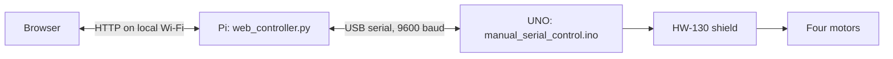

# Current architecture

The browser sends operator commands to a Python HTTP server on the Raspberry Pi.
The server is the sole owner of the UNO USB serial port. The UNO interprets
commands and drives one motor per HW-130 shield channel.

## Command lifecycle

The browser acquires a short-lived control token and sends movement commands
every 100 ms while a control is held. Only one browser owns movement at a time.
The server rejects reordered commands and expires ownership after a 300 ms
command gap. Release invalidates the token; late requests cannot restart that
session. X/Space provides a global stop, including from another browser.

The UNO independently releases motors after 300 ms without a movement command.
It starts stopped and stops on malformed commands. Configuration changes do not
refresh the movement watchdog. Recovery from a connection problem requires a
fresh operator press; USB failure requires restarting the server.

These software timeouts do not guarantee physical stopping distance. Releasing
a motor is not active braking. Hardware disconnect behavior must be checked
on each build.

## Protocol and configuration

The serial link uses single-character direction/speed commands,
newline-terminated curve settings, and protocol-2 configuration responses.
The web server requires compatible firmware before allowing movement. Request
sequence numbers belong to the browser/server interface, not the UNO protocol.
See the [firmware reference](../firmware/uno/README.md) for details.

## Runtime files

- `tools/web_controller.py`: HTTP server, serial bridge, control ownership, and bounded event log.
- `tools/web/`: browser interface served by that controller.
- `pi/run.sh`: headless launcher listening on all IPv4 interfaces, port 8765.
- `pi/deploy.sh`: copies runtime files into releases and selects `~/robotcar/current`.
- `pi/install-service.sh`: optional systemd installer running as the normal Pi user with serial access.

Direct invocation of the Python server defaults to loopback. Pi operation is
intended only for a trusted LAN: request-origin checks and control tokens are
not user authentication. Do not expose the server to the internet.

Power connections and motor mapping are in [hardware and wiring](HARDWARE.md).
Nicla sensing, data recording, AI inference, battery telemetry, and ultrasonic
stopping are future work and are not part of this runtime.
